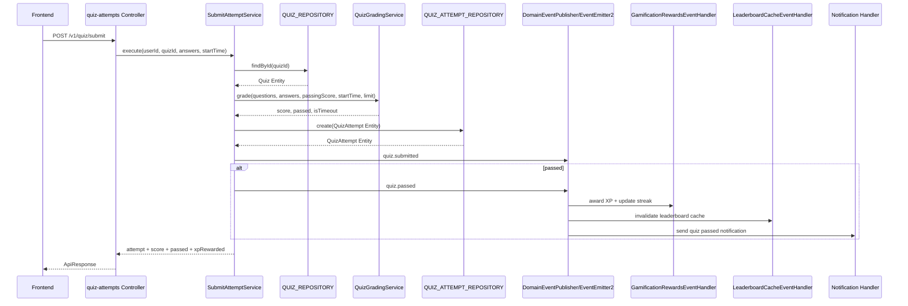

# DEV4 Module Flow And Architecture

> Phạm vi: `quiz`, `quiz-attempts`, `gamification`, `leaderboard`, `subscription`.
>
> Mục tiêu tài liệu: giúp DEV4 đọc lại được luồng hoạt động thật trong code, hiểu module nào sở hữu nghiệp vụ nào, dữ liệu đi qua tầng nào, event nào kích hoạt side-effect nào, và khi sửa code thì sửa ở đâu cho đúng Clean Architecture.

---

## 1. Bức tranh tổng quan

Các module DEV4 đang đi theo Clean Architecture 4 tầng:

```text
presentation  ->  application  ->  domain  <-  infrastructure
HTTP/API          use-case          core        Mongo/Redis/payment adapter
```

Luật quan trọng nhất:

- `domain/` không biết NestJS, Mongoose, controller, repository implementation.
- `application/` điều phối use-case, inject port qua token.
- `infrastructure/` là nơi duy nhất đụng Mongoose/Redis/payment SDK.
- `presentation/` chỉ nhận request, validate DTO, gọi service, trả `ApiResponse`.
- Side-effect như XP, streak, leaderboard cache, subscription activation phải đi qua event handler.

---

## 2. Trạng thái module DEV4 hiện tại

| Module | UC | Vai trò | Trạng thái |
|---|---:|---|---|
| `quiz` | UC36-39 | Admin CRUD quiz/question | Đã tách 4 tầng, repo trả Entity |
| `quiz-attempts` | UC40-43 | Student lấy quiz, nộp bài, xem lịch sử/kết quả | Core sạch, chấm điểm ở domain service, emit event |
| `gamification` | UC48-49 | XP, level, streak, stats | Có Rich Domain Model `UserStats`, nghe event để cộng XP |
| `leaderboard` | UC50 | Bảng xếp hạng XP | Đọc stats qua port gamification, cache Redis, invalidate bằng event |
| `subscription` | UC51-52 | Plan CRUD, purchase, payment webhook, activate subscription | Greenfield 4 tầng |

---

## 3. Luồng chính từ quiz đến leaderboard



Điểm cần nhớ:

- `quiz-attempts` không tự cộng XP.
- `quiz-attempts` không tự cập nhật leaderboard.
- `quiz-attempts` chỉ lưu attempt và emit event.
- `gamification`, `leaderboard`, `notifications` là module tự phản ứng với event.

---

## 4. Module `quiz`

### 4.1 Vai trò

`quiz` sở hữu dữ liệu quiz và câu hỏi:

- Tạo quiz.
- Cập nhật quiz.
- Xóa quiz.
- Thêm/sửa/xóa question.
- Lấy quiz theo id hoặc lesson.

### 4.2 Cấu trúc chính

```text
src/modules/quiz/
├── domain/
│   ├── entities/quiz.entity.ts
│   ├── entities/question.entity.ts
│   └── interfaces/quiz.repository.ts
├── application/
│   ├── dto/quiz.dto.ts
│   └── services/*.service.ts
├── infrastructure/
│   ├── mapper/quiz.mapper.ts
│   └── persistence/mongo-quiz.repository.ts
└── presentation/
    ├── controller/quiz.controller.ts
    └── response/quiz.presenter.ts
```

### 4.3 Luồng tạo quiz

```text
POST /v1/quiz
  -> QuizController.create()
  -> CreateQuizService.execute()
  -> Quiz.createNew()
  -> QUIZ_REPOSITORY.create()
  -> MongoQuizRepository
  -> QuizMapper.toPersistence()
  -> MongoDB
  -> QuizMapper.toEntity()
  -> QuizPresenter.toResponse()
  -> ApiResponse
```

### 4.4 Vai trò từng file

| File | Vai trò |
---|---|
| `domain/entities/quiz.entity.ts` | Business rule của quiz: tạo mới, update, quản lý questions |
| `domain/entities/question.entity.ts` | Entity thuần cho question |
| `domain/interfaces/quiz.repository.ts` | Port DB của quiz, token `QUIZ_REPOSITORY` |
| `infrastructure/mapper/quiz.mapper.ts` | Chuyển Mongo doc `<->` Entity |
| `infrastructure/persistence/mongo-quiz.repository.ts` | Adapter Mongoose, implements port |
| `presentation/controller/quiz.controller.ts` | Route admin/student view, validate input |
| `presentation/response/quiz.presenter.ts` | Format response cho FE |

### 4.5 Giao tiếp module khác

`quiz-attempts` đọc quiz thông qua `QUIZ_REPOSITORY`, không import model của quiz.

Đúng:

```ts
@Inject(QUIZ_REPOSITORY)
private readonly quizRepository: IQuizRepository
```

Sai:

```ts
import { Quiz } from '../../quiz/models/quiz.model';
```

---

## 5. Module `quiz-attempts`

### 5.1 Vai trò

`quiz-attempts` sở hữu luồng học viên làm bài:

- Student lấy quiz theo lesson.
- Student nộp bài.
- System chấm bài.
- Student xem lịch sử attempt.
- Student xem chi tiết attempt.

### 5.2 Luồng nộp bài

```text
POST /v1/quiz/submit
  -> QuizAttemptsController.submit()
  -> SubmitAttemptService.execute()
  -> QUIZ_REPOSITORY.findById()
  -> QuizGradingService.grade()
  -> QuizAttempt.createNew()
  -> QUIZ_ATTEMPT_REPOSITORY.create()
  -> DomainEventPublisher.publish('quiz.submitted')
  -> if passed: DomainEventPublisher.publish('quiz.passed')
  -> response includes score, passed, xpRewarded, isTimeout
```

### 5.3 Chấm điểm nằm ở đâu?

Chấm điểm nằm trong:

```text
src/modules/quiz-attempts/domain/services/quiz-grading.service.ts
```

Đây là domain service thuần:

- Không DB.
- Không HTTP.
- Không NestJS dependency.
- Chỉ nhận questions, answers, passing score, start time, time limit.
- Trả về `score`, `passed`, `isTimeout`.

### 5.4 Event phát ra

| Event | Khi nào phát | Ai nghe |
---|---|---|
| `quiz.submitted` | Sau khi attempt được lưu | Dành cho audit/extension sau này |
| `quiz.passed` | Khi bài pass | `gamification`, `leaderboard`, `notifications` |

### 5.5 DomainEventPublisher

File:

```text
src/modules/quiz-attempts/application/events/domain-event.publisher.ts
```

Hiện tại publisher vừa emit local `EventEmitter`, vừa bridge sang global `EventEmitter2`.

Ý nghĩa:

- Code cũ có thể subscribe local.
- Code mới dùng `@OnEvent('quiz.passed')` vẫn nhận được event qua global EventEmitter2.

---

## 6. Module `gamification`

### 6.1 Vai trò

`gamification` sở hữu:

- XP.
- Level.
- Streak.
- User stats.
- Đồng bộ tiến độ lesson/course sang stats.

### 6.2 Cấu trúc chính

```text
src/modules/gamification/
├── domain/
│   ├── entities/user-stats.entity.ts
│   ├── interfaces/user-stats.repository.ts
│   ├── interfaces/student-progress.port.ts
│   └── services/level-calculator.ts
├── application/
│   ├── services/award-xp.service.ts
│   ├── services/update-streak.service.ts
│   ├── services/get-stats.service.ts
│   └── event-handlers/gamification-rewards.event-handler.ts
├── infrastructure/
│   ├── mapper/user-stats.mapper.ts
│   ├── persistence/repositories/mongo-user-stats.repository.ts
│   ├── persistence/schemas/user-stats.schema.ts
│   └── adapters/mongo-student-progress.adapter.ts
└── presentation/
    ├── controller/gamification.controller.ts
    └── response/user-stats.presenter.ts
```

### 6.3 Luồng cộng XP khi pass quiz

```text
quiz-attempts emits 'quiz.passed'
  -> GamificationRewardsEventHandler.handleQuizPassed()
  -> AwardXpService.execute(userId, xpReward, quizzesCompletedDelta = 1)
  -> USER_STATS_REPOSITORY.findOrCreate(userId)
  -> UserStats.addXp()
  -> USER_STATS_REPOSITORY.save()
  -> UpdateStreakService.execute()
  -> UserStats.updateStreak()
  -> save
```

### 6.4 Vì sao `UserStats` là Rich Domain Model?

`UserStats` không chỉ là data object. Nó chứa business rule:

- `addXp()`: cộng XP, tăng số quiz hoàn thành, tính lại level.
- `updateStreak()`: cập nhật streak theo ngày hoạt động.
- `syncProgress()`: đồng bộ lesson/course completed với XP tối thiểu.

Điều này giúp:

- Business rule nằm trong domain.
- Application service chỉ điều phối.
- Unit test domain dễ hơn.

### 6.5 Port quan trọng

| Port | Mục đích |
---|---|
| `USER_STATS_REPOSITORY` | Đọc/ghi UserStats |
| `STUDENT_PROGRESS_PORT` | Đọc tiến độ lesson/course từ enrollment qua adapter |

### 6.6 Lưu ý kỹ thuật

`gamification/models/user-stats.model.ts` vẫn tồn tại như re-export legacy vì các module ngoài DEV4 còn import. Không nên xóa file này nếu chưa refactor `admin`, `auth`, `users`.

---

## 7. Module `leaderboard`

### 7.1 Vai trò

`leaderboard` sở hữu UC50:

- Lấy top ranking.
- Lấy rank của user hiện tại.
- Cache leaderboard bằng Redis.
- Invalidate cache khi XP thay đổi.

### 7.2 Cấu trúc chính

```text
src/modules/leaderboard/
├── domain/
│   ├── interfaces/leaderboard-cache.port.ts
│   ├── interfaces/user-profile.port.ts
│   └── services/ranking.service.ts
├── application/
│   ├── services/get-top-rankings.service.ts
│   ├── services/get-my-rank.service.ts
│   └── event-handlers/leaderboard-cache.event-handler.ts
├── infrastructure/
│   ├── adapters/redis-leaderboard-cache.adapter.ts
│   └── adapters/mongo-user-profile.adapter.ts
└── presentation/
    ├── controller/leaderboard.controller.ts
    └── response/leaderboard.presenter.ts
```

### 7.3 Luồng `GET /v1/leaderboard`

```text
GET /v1/leaderboard?limit=10
  -> LeaderboardController.getTopRankings()
  -> GetTopRankingsService.execute(limit)
  -> LEADERBOARD_CACHE_PORT.getTopRankings(limit)
     -> if cache hit: return cached ranked entries
     -> if cache miss:
        -> USER_STATS_REPOSITORY.findTopByXp(limit)
        -> USER_PROFILE_PORT.findByUserIds(userIds)
        -> RankingDomainService.buildRankedList(stats, profiles)
        -> LEADERBOARD_CACHE_PORT.syncRankings(rankedList)
        -> return ranked list
  -> LeaderboardPresenter.toTopResponse()
  -> ApiResponse
```

### 7.4 Luồng `GET /v1/leaderboard/me`

```text
GET /v1/leaderboard/me
  -> JwtAuthGuard
  -> CurrentUser
  -> LeaderboardController.myRank()
  -> GetMyRankService.execute(user.id)
  -> USER_STATS_REPOSITORY.findByUserId(user.id)
     -> if no stats: { rank: null, xp: 0 }
  -> USER_STATS_REPOSITORY.findRankByUserId(user.id)
  -> LeaderboardPresenter.toMyRankResponse()
  -> ApiResponse
```

### 7.5 RankingDomainService làm gì?

File:

```text
src/modules/leaderboard/domain/services/ranking.service.ts
```

Nhiệm vụ:

- Nhận danh sách stats đã sort theo XP giảm dần.
- Nhận profile user.
- Gắn `rank = index + 1`.
- Merge name/avatar vào kết quả.

Đây là pure logic:

- Không DB.
- Không Redis.
- Không NestJS.

### 7.6 Cache Redis hoạt động thế nào?

Port:

```text
LEADERBOARD_CACHE_PORT
```

Adapter:

```text
RedisLeaderboardCacheAdapter
```

Luồng:

1. Query leaderboard trước tiên đọc Redis.
2. Nếu Redis có data thì trả luôn.
3. Nếu Redis trống/lỗi thì fallback DB.
4. Sau khi build ranked list từ DB, service sync ngược lại Redis.

### 7.7 Cache invalidation

File:

```text
src/modules/leaderboard/application/event-handlers/leaderboard-cache.event-handler.ts
```

Handler nghe:

| Event | Lý do invalidate |
---|---|
| `quiz.passed` | User có thể vừa được cộng XP |
| `lesson.completed` | User có thể vừa được cộng XP |
| `course.completed` | User có thể vừa được cộng XP |

Luồng:

```text
XP-changing event
  -> LeaderboardCacheEventHandler
  -> LEADERBOARD_CACHE_PORT.invalidate()
  -> Redis DEL leaderboard key
```

Điểm hay:

- Use-case submit quiz không biết leaderboard.
- Gamification không biết leaderboard.
- Leaderboard tự chịu trách nhiệm cache của nó.

### 7.8 Cross-module dependency của leaderboard

`leaderboard` đọc XP qua port của `gamification`:

```text
USER_STATS_REPOSITORY
```

Điều này đúng vì:

- `leaderboard` không import `gamification/models`.
- `leaderboard` không biết schema Mongo của `UserStats`.
- Nếu sau này đổi cách lưu stats, leaderboard không bị ảnh hưởng nếu port giữ nguyên.

### 7.9 Điểm cần cải thiện sau này

Trong `GetTopRankingsService`, đoạn sync Redis đang fire-and-forget:

```ts
this.cachePort.syncRankings(rankedList).catch(() => {});
```

Điểm này không làm sai luồng chính, vì leaderboard vẫn trả data từ DB. Nhưng nên cải thiện sau:

- Log warning khi sync cache fail.
- Hoặc dùng logger chuẩn.
- Hoặc tạo metric/monitor cho Redis failure.

---

## 8. Module `subscription`

### 8.1 Vai trò

`subscription` sở hữu:

- UC51: Admin CRUD Plan.
- UC52: Student purchase plan.
- Payment gateway qua port.
- Payment webhook.
- Activate/extend subscription bằng event `payment.succeeded`.

### 8.2 Cấu trúc chính

```text
src/modules/subscription/
├── domain/
│   ├── entities/plan.entity.ts
│   ├── entities/purchase.entity.ts
│   ├── entities/subscription.entity.ts
│   └── interfaces/*.ts
├── application/
│   ├── dto/plan.dto.ts
│   ├── services/*.service.ts
│   └── event-handlers/payment-succeeded.handler.ts
├── infrastructure/
│   ├── mapper/*.mapper.ts
│   ├── payment/vnpay.adapter.ts
│   └── persistence/*.repository.ts + schemas/
└── presentation/
    ├── controller/plan.controller.ts
    ├── controller/subscription.controller.ts
    └── response/*.presenter.ts
```

### 8.3 UC51 Admin CRUD Plan

Routes:

```text
POST   /v1/subscription/plans
GET    /v1/subscription/plans
GET    /v1/subscription/plans/:id
PUT    /v1/subscription/plans/:id
DELETE /v1/subscription/plans/:id
```

Tất cả route plan đang có:

- `JwtAuthGuard`
- `@Roles('ADMIN')`
- `ZodValidationPipe`
- `ApiResponse.success`

Luồng tạo plan:

```text
PlanController.create()
  -> CreatePlanService.execute()
  -> PLAN_REPOSITORY.findByName()
  -> Plan.createNew()
  -> PLAN_REPOSITORY.create()
  -> MongoPlanRepository
  -> PlanMapper
  -> MongoDB
  -> PlanPresenter
  -> ApiResponse
```

### 8.4 UC52 Purchase Flow

Routes:

```text
POST /v1/subscription/purchase
GET  /v1/subscription/my-subscription
POST /v1/subscription/webhook/payment
```

Luồng purchase:

```text
POST /v1/subscription/purchase
  -> JwtAuthGuard
  -> SubscriptionController.purchase()
  -> PurchasePlanService.execute(userId, planId)
  -> PLAN_REPOSITORY.findById(planId)
  -> Purchase.createNew()
  -> PURCHASE_REPOSITORY.create()
  -> PAYMENT_GATEWAY.createPayment()
  -> Purchase.attachPayment(transactionId, paymentUrl)
  -> PURCHASE_REPOSITORY.update()
  -> PurchasePresenter.toResponse()
```

Luồng webhook:

```text
POST /v1/subscription/webhook/payment
  -> ProcessPaymentWebhookService.execute(payload)
  -> PAYMENT_GATEWAY.verifyWebhook(payload)
  -> PURCHASE_REPOSITORY.findById() or findByTransactionId()
  -> if succeeded:
       Purchase.markSucceeded()
       PURCHASE_REPOSITORY.update()
       EventEmitter2.emit('payment.succeeded')
     else:
       Purchase.markFailed()
       PURCHASE_REPOSITORY.update()
```

Luồng activate subscription:

```text
payment.succeeded
  -> PaymentSucceededHandler
  -> PLAN_REPOSITORY.findById(planId)
  -> SUBSCRIPTION_REPOSITORY.findActiveByUserId(userId, now)
     -> if active exists: existing.extend(planId, durationDays, now)
     -> else: Subscription.createActive()
  -> save subscription
```

### 8.5 Payment gateway port

Port:

```text
src/modules/subscription/domain/interfaces/payment-gateway.port.ts
```

Adapter:

```text
src/modules/subscription/infrastructure/payment/vnpay.adapter.ts
```

Ý nghĩa:

- Domain/application không biết SDK VNPay.
- Khi tích hợp VNPay thật, chỉ thay adapter.
- Use-case `PurchasePlanService` chỉ gọi `PAYMENT_GATEWAY`.

---

## 9. Các event quan trọng

| Event | Publisher | Listener | Kết quả |
---|---|---|---|
| `quiz.submitted` | `SubmitAttemptService` | Chưa có handler chính | Dành cho audit/mở rộng |
| `quiz.passed` | `SubmitAttemptService` | `GamificationRewardsEventHandler` | Cộng XP, update streak |
| `quiz.passed` | `SubmitAttemptService` | `LeaderboardCacheEventHandler` | Invalidate leaderboard cache |
| `quiz.passed` | `SubmitAttemptService` | Notification handler nếu đăng ký | Gửi thông báo |
| `lesson.completed` | Enrollment flow | Gamification + Leaderboard | Cộng XP, invalidate cache |
| `course.completed` | Enrollment flow | Gamification + Leaderboard | Cộng XP, invalidate cache |
| `payment.succeeded` | `ProcessPaymentWebhookService` | `PaymentSucceededHandler` | Activate/extend subscription |

---

## 10. Khi sửa code thì sửa ở đâu?

| Muốn sửa | Sửa ở đâu |
---|---|
| Đổi logic chấm quiz | `quiz-attempts/domain/services/quiz-grading.service.ts` |
| Đổi format response quiz attempt | `quiz-attempts/presentation/response/quiz-attempt.presenter.ts` |
| Đổi rule cộng XP/level | `gamification/domain/entities/user-stats.entity.ts` hoặc `level-calculator.ts` |
| Đổi cách lấy completed lessons/courses | `gamification/infrastructure/adapters/mongo-student-progress.adapter.ts` hoặc port tương ứng |
| Đổi thuật toán ranking | `leaderboard/domain/services/ranking.service.ts` |
| Đổi cache Redis leaderboard | `leaderboard/infrastructure/adapters/redis-leaderboard-cache.adapter.ts` |
| Đổi response leaderboard | `leaderboard/presentation/response/leaderboard.presenter.ts` |
| Đổi rule plan/subscription | `subscription/domain/entities/*.entity.ts` |
| Tích hợp payment gateway thật | `subscription/infrastructure/payment/vnpay.adapter.ts` |
| Đổi route/API subscription | `subscription/presentation/controller/*.controller.ts` |

---

## 11. Những điểm cần nhớ khi bảo trì

1. Controller không được gọi model.
2. Application service không được import Mongoose schema/model.
3. Domain không được import NestJS.
4. Repository luôn trả Entity, không trả doc thô.
5. Mapper là nơi duy nhất biết persistence shape.
6. Presenter là nơi duy nhất format response.
7. Side-effect phải là event handler.
8. Cross-module phải qua port/export hoặc event.
9. Đừng copy legacy folder `models/`, `services/`, `controllers/` phẳng nếu đang làm module mới.
10. Với subscription, payment SDK chỉ nằm trong infrastructure adapter.

---

## 12. Self-check nhanh cho DEV4

Chạy build:

```bash
npx tsc --noEmit
```

Chạy test:

```bash
npm test
```

Kiểm tra riêng module `subscription`:

```bash
rg -n -e "from 'mongoose'" -e "\.model'" -e "\.schema'" -e "@nestjs" -e "presentation/" src/modules/subscription/domain
rg -n -e "from 'mongoose'" -e "\.model'" -e "\.schema'" src/modules/subscription/application
rg -n -e "from 'mongoose'" -e "\.model'" src/modules/subscription/presentation
rg -n -e "modules/.*model" -e "\.\./\.\./\.\./.*Service" -e "\.\./\.\./\.\./.*service" src/modules/subscription
```

Kết quả mong muốn: không có dòng output.

Kiểm tra leaderboard không import model gamification:

```bash
rg -n "gamification/models|UserStatsModel|user-stats.model" src/modules/leaderboard
```

Kết quả mong muốn: không có dòng output.

---

## 13. Tóm tắt 30 giây

`quiz` tạo và quản lý quiz. `quiz-attempts` lấy quiz qua port, chấm điểm bằng domain service, lưu attempt và emit event. `gamification` nghe event để cộng XP/streak. `leaderboard` đọc XP qua `USER_STATS_REPOSITORY`, build rank bằng domain service, cache Redis và tự invalidate khi có event làm thay đổi XP. `subscription` quản lý plan, purchase qua payment gateway port, webhook emit `payment.succeeded`, handler tạo/gia hạn subscription.

Nếu sửa code, hãy đi theo câu hỏi: "Nghiệp vụ này thuộc module nào?" rồi sửa ở đúng tầng của module đó.
