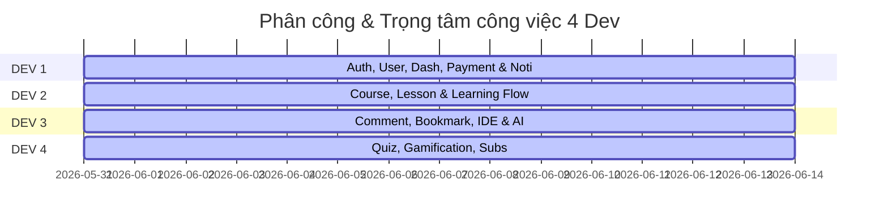

# ThreadLearn Backend — Bảng Đối Chiếu Use Case Final (53 UC — Phân Công 4 Dev)

Bản đối chiếu này được cập nhật theo danh sách **53 Use Case (UC) chính thức** được phân chia khoa học cho 4 lập trình viên (DEV 1, DEV 2, DEV 3, DEV 4) chịu trách nhiệm phát triển dự án ThreadLearn. Mục đích nhằm quản lý tiến độ, giám sát trạng thái hiện tại (Done, Partial, Missing) và đảm bảo sự khớp nối hoàn hảo giữa tầng nghiệp vụ và mã nguồn thực tế.

---

## 📊 Thống Kê Tổng Quan Hệ Thống

| Trạng thái | Số lượng | Tỷ lệ | Mô tả |
| :--- | :---: | :---: | :--- |
| ✅ **Đã hoàn thiện (Done)** | **19** | 35.8% | Tính năng đã triển khai đầy đủ cả ở tầng Controller (API Route) và Service. |
| 🔶 **Một phần (Partial)** | **10** | 18.9% | Đã viết logic Service thô hoặc một phần DB Schema nhưng chưa có Route API hoặc còn thiếu tính năng nhỏ. |
| ❌ **Chưa có (Missing)** | **24** | 45.3% | Chưa có mã nguồn hoặc mới chỉ là khung rỗng, cần phát triển mới từ đầu. |
| **Tổng số Use Case** | **53** | **100%** | **Hệ thống lõi ThreadLearn** |

---

## 👥 Phân Bổ Công Việc Theo Developer

| Developer | Lĩnh vực phụ trách chính | Số lượng UC | Trạng thái hiện tại |
| :--- | :--- | :---: | :--- |
| **DEV 1** | Auth, OAuth, User Management, Dashboard Statistics, Payment, Core System | 14 UC (UC01 - UC14) | ✅ 4 Done, 🔶 3 Partial, ❌ 7 Missing |
| **DEV 2** | Course, Lesson, Learning Experience, Vector Search, Progress | 14 UC (UC15 - UC28) | ✅ 4 Done, 🔶 5 Partial, ❌ 5 Missing |
| **DEV 3** | Comments, Bookmarks, Notes, Monaco IDE, Judge0, AI Recommendation | 12 UC (UC29-35, UC44-47, UC53) | ✅ 5 Done, 🔶 0 Partial, ❌ 7 Missing |
| **DEV 4** | Quiz Engine, Grading, XP Engine, Leaderboard, Subscription Plans | 13 UC (UC36-43, UC48-52) | ✅ 6 Done, 🔶 2 Partial, ❌ 5 Missing |

---

## 📋 Chi Tiết 53 Use Case & Bảng Ánh Xạ Mã Nguồn

---

### 💻 DEV 1 — Authentication, User Management, Dashboard, Payment & Notification
*Trọng tâm công nghệ: JWT, OAuth, RBAC, Middleware, User stats initialization, Analytics Aggregation Pipelines.*

| UC | Tên Use Case | Trạng thái | Mã nguồn hiện tại / Chỉ dẫn kỹ thuật |
| :--- | :--- | :---: | :--- |
| **UC01** | Register Account (Guest) | ✅ Done | `AuthController.register()`, `AuthService.register()`, endpoint `POST /api/v1/auth/register`. Tự động tạo `UserStats`. |
| **UC02** | Register with Google (Guest, Google OAuth System) | ❌ Missing | OAuth cũ đã bị gỡ khi migrate. Cần triển khai Passport Google strategy. |
| **UC03** | Verify Email (Guest, Email System) | 🔶 Partial | Có logic đăng ký thô nhưng chưa chặn login khi chưa verify, chưa gửi mail verify qua Nodemailer. |
| **UC04** | Log In (Student, Admin) | ✅ Done | `AuthController.login()`, `AuthService.login()`, endpoint `POST /api/v1/auth/login`. So khớp hash bằng `bcrypt.compare()`. |
| **UC05** | Log In with Google (Student, Admin, Google OAuth System) | ❌ Missing | Chưa có NestJS OAuth strategy. Cần tích hợp Passport Google OAuth 2.0. |
| **UC06** | Log Out (Student, Admin, Authentication System) | ✅ Done | `AuthController.logout()`, `AuthService.logout()`, endpoint `POST /api/v1/auth/logout`. Xóa RefreshToken. |
| **UC07** | Forgot Password (Student, Admin, Email System) | ❌ Missing | Chưa có. Cần tạo model `PasswordResetToken` và API `/auth/forgot-password`. |
| **UC08** | Reset Password (Student, Admin, Authentication System) | ❌ Missing | Chưa có. Cần API `/auth/reset-password` xác thực token và cập nhật password mới. |
| **UC09** | Update Personal Profile / Upload Avatar (Student, Admin, Storage System) | ✅ Done | `UsersController.uploadAvatar()`, `saveUploadedFile()`, endpoint `POST /api/v1/users/avatar`. |
| **UC10** | Add Student (Admin) | ❌ Missing | Chưa có. Cần hàm `createStudent` trong `AdminService` để tạo tài khoản thủ công từ dashboard. |
| **UC11** | Lock / Unlock Student (Admin) | ❌ Missing | Chưa có. Cần trường `isLocked` trong `User` model, hàm lật trạng thái ở `AdminService` và chặn tại `JwtAuthGuard`. |
| **UC12** | View Student List (Admin) | 🔶 Partial | Đã có hàm `AdminService.listUsers()` nhưng chưa viết API Route `GET /api/v1/admin/users`. |
| **UC13** | Update Student Information (Admin) | ❌ Missing | Chưa có. Cần viết hàm `updateUserByAdmin()` cho phép Admin đổi tên, role, trạng thái. |
| **UC14** | View Statistics Charts (Admin, Analytics System) | 🔶 Partial | Có [analytics.service.ts](file:///d:/FPT_University_các%20kì/kì%208/WDP301/ThreadLearn_WEB_BE/src/modules/analytics/services/analytics.service.ts) đếm số lượng người dùng/khóa học/làm bài. Thiếu biểu đồ time-series và doanh thu. |

---

### 📚 DEV 2 — Course, Lesson & Learning Experience
*Trọng tâm công nghệ: Course/Lesson Schemas, Mongoose Text Indexes, MongoDB Atlas Vector Search, Enrollment Progress Engine.*

| UC | Tên Use Case | Trạng thái | Mã nguồn hiện tại / Chỉ dẫn kỹ thuật |
| :--- | :--- | :---: | :--- |
| **UC15** | Add New Course (Admin) | 🔶 Partial | Đã có `CoursesService.createCourse()`. Thiếu trường `tags[]`, `level`, `language` trong model và API upload thumbnail riêng. |
| **UC16** | Edit Course Information (Admin) | ❌ Missing | Chưa có. Cần viết hàm `updateCourse` trong `CoursesService` và Route `PUT /api/v1/courses/:id`. |
| **UC17** | Hide / Show Course (Admin) | ✅ Done | `AdminService.toggleCoursePublish()`, thay đổi cờ `isPublished` giữa `true` và `false`. |
| **UC18** | Delete Course (Admin) | ❌ Missing | Chưa có. Cần cấu trúc Soft Delete bằng cờ `isDeleted` trong `CourseSchema`. |
| **UC19** | Add Lesson to Course (Admin) | 🔶 Partial | Có `LessonsService.createLesson()`. Thiếu trường `duration`, `videoUrl` trong `LessonSchema` và thiếu Route API POST tạo bài học. |
| **UC20** | Edit / Upgrade Lesson (Admin) | ❌ Missing | Chưa có. Cần hàm `updateLesson` trong `LessonsService` và API Route sửa bài học. |
| **UC21** | Lock / Unlock Lesson (Admin) | ❌ Missing | Chưa có. Cần trường `isLocked` trong `Lesson` model và cơ chế chặn học viên truy cập nếu chưa hoàn thành bài trước. |
| **UC22** | Delete Lesson (Admin) | ❌ Missing | Chưa có. Cần hàm `deleteLesson` trong `LessonsService` và API Route DELETE. |
| **UC23** | View Course Detail (Guest, Student, Admin) | ✅ Done | `CoursesController.getCourseById()`, `CoursesService.getCourseDetail()`. Trả đầy đủ thông tin chi tiết. |
| **UC24** | Search / Filter Courses - MongoDB Vector Search (Guest, Student, Admin) | 🔶 Partial | Có tìm kiếm text index cơ bản. Thiếu Semantic Search với Vector Embeddings và lọc nâng cao theo tags/level/lang. |
| **UC25** | View Lesson (Student, Admin, Guest if free lesson) | ✅ Done | `LessonsController.getLessonById()`, `LessonsService.getLesson()`. Trả Markdown content và attachmentUrl. |
| **UC26** | Enroll in Course (Student) | 🔶 Partial | Có `EnrollmentsService.enrollInCourse()` tạo bản ghi. Chưa có Route API POST `GET/POST /api/v1/enrollments` để học viên đăng ký. |
| **UC27** | Complete Lesson (Student) | 🔶 Partial | Có `EnrollmentsService.updateLessonProgress()` tính tiến trình học và cộng 500 XP. Chưa có Route API để trigger tiến độ bài học. |
| **UC28** | Track Learning Progress (Student, System) | ✅ Done | Hoạt động thông qua `Enrollment` model cập nhật trường `progress` (%) và tự động chuyển đổi cờ `completed` khi đạt 100%. |

---

### 💬 DEV 3 — Comment, Bookmark, Note, IDE & AI Features
*Trọng tâm công nghệ: Comment Tree Hierarchy, Monaco Editor integration, Judge0 integration, AI recommendation, Socket.IO.*

| UC | Tên Use Case | Trạng thái | Mã nguồn hiện tại / Chỉ dẫn kỹ thuật |
| :--- | :--- | :---: | :--- |
| **UC29** | Add Comment in Lesson (Student) | ❌ Missing | Chưa có. Cần tạo model `Comment` và API POST `/comments` lưu nội dung. |
| **UC30** | Reply to Comment (Student, Admin) | ❌ Missing | Chưa có. Cần trường `parentId` trong model `Comment` tạo cây phân cấp. |
| **UC31** | Edit Comment (Student, Admin) | ❌ Missing | Chưa có. Cần API PUT `/comments/:id` và kiểm tra quyền sở hữu chính chủ. |
| **UC32** | Delete Comment (Student, Admin) | ❌ Missing | Chưa có. Cần API DELETE `/comments/:id` hỗ trợ xóa bởi chủ nhân hoặc Admin. |
| **UC33** | View Lesson Bookmarks (Student) | ❌ Missing | Chưa có. Cần model `Bookmark` `{ userId, lessonId }` và API GET `/bookmarks`. |
| **UC34** | Save Lesson Bookmark (Student) | ❌ Missing | Chưa có. Cần API POST `/bookmarks` để toggle lưu/hủy đánh dấu bài học. |
| **UC35** | Add Note in Lesson (Student) | ❌ Missing | Chưa có. Cần model `Note` `{ userId, lessonId, noteText }` và API CRUD `/notes`. |
| **UC44** | Run Code in IDE (Student, Code Execution System / Judge0) | ✅ Done | `CodeExecutionService.executeCode()`, chuyển đổi mã nguồn sang Base64 gửi Judge0 API. Có Mock local fallback. |
| **UC45** | View Code Execution Output (Student, Code Execution System) | ✅ Done | Decode kết quả stdout/stderr từ Base64, hiển thị kèm bộ nhớ (memory) và thời gian thực thi (time) từ Judge0. |
| **UC46** | Submit Code and Request AI Recommendation (Student, AI System) | ✅ Done | `AIController.requestRecommendation()`, `AIService.requestRecommendation()`. Gửi lộ trình cá nhân hóa dựa trên học lực. |
| **UC47** | View AI Chat / Analysis History (Student, AI System) | ✅ Done | [ai.service.ts](file:///d:/FPT_University_các%20kì/kì%208/WDP301/ThreadLearn_WEB_BE/src/modules/ai/services/ai.service.ts) (`getHistoryLogs()`) lấy logs từ `ai-history.model.ts`. |
| **UC53** | View Notifications (Student, Admin, Notification System) | ✅ Done | [notifications.service.ts](file:///d:/FPT_University_các%20kì/kì%208/WDP301/ThreadLearn_WEB_BE/src/modules/notifications/services/notifications.service.ts), lưu DB và phát Socket.IO thời gian thực. |

---

### 🏆 DEV 4 — Quiz, Quiz Runtime, Quiz History, Gamification, Leaderboard & Subscription
*Trọng tâm công nghệ: Quiz Schema, attempts grading, Redis Sorted Set (`ZADD`, `ZREVRANGEWITHSCORES`), XP & Level engine, Payment Gateway Integration.*

| UC | Tên Use Case | Trạng thái | Mã nguồn hiện tại / Chỉ dẫn kỹ thuật |
| :--- | :--- | :---: | :--- |
| **UC36** | Create Quiz (Admin) | ✅ Done | [quiz.service.ts](file:///d:/FPT_University_các%20kì/kì%208/WDP301/ThreadLearn_WEB_BE/src/modules/quiz/services/quiz.service.ts) (`createQuiz()`) lưu Quiz thuộc Lesson kèm đáp án đúng. |
| **UC37** | Add Question (Admin) | ✅ Done | [quiz.controller.ts](file:///d:/FPT_University_các%20kì/kì%208/WDP301/ThreadLearn_WEB_BE/src/modules/quiz/controllers/quiz.controller.ts) (`addQuestion`) thêm câu hỏi vào Quiz qua toán tử `$push`. |
| **UC38** | Edit Question (Admin) | ✅ Done | [quiz.controller.ts](file:///d:/FPT_University_các%20kì/kì%208/WDP301/ThreadLearn_WEB_BE/src/modules/quiz/controllers/quiz.controller.ts) (`editQuestion`) sửa đổi câu hỏi bằng positional `$set`. |
| **UC39** | Delete Question (Admin) | ✅ Done | [quiz.controller.ts](file:///d:/FPT_University_các%20kì/kì%208/WDP301/ThreadLearn_WEB_BE/src/modules/quiz/controllers/quiz.controller.ts) (`deleteQuestion`) xóa câu hỏi khỏi Quiz sử dụng `$pull`. |
| **UC40** | Take Quiz (Student) | ✅ Done | [quiz-attempts.controller.ts](file:///d:/FPT_University_các%20kì/kì%208/WDP301/ThreadLearn_WEB_BE/src/modules/quiz-attempts/controllers/quiz-attempts.controller.ts) (`getQuizByLesson` & `submit`) kèm kiểm tra giới hạn thời gian làm bài `timeLimitSeconds`. |
| **UC41** | Grade Quiz (System) | ✅ Done | [quiz-attempts.service.ts](file:///d:/FPT_University_các%20kì/kì%208/WDP301/ThreadLearn_WEB_BE/src/modules/quiz-attempts/services/quiz-attempts.service.ts) chấm điểm tự động và lưu lịch sử. |
| **UC42** | View Quiz Result (Student) | ✅ Done | [quiz-attempts.controller.ts](file:///d:/FPT_University_các%20kì/kì%208/WDP301/ThreadLearn_WEB_BE/src/modules/quiz-attempts/controllers/quiz-attempts.controller.ts) (`getAttemptById`) lấy kết quả chi tiết của lượt làm bài. |
| **UC43** | View Quiz Attempt History (Student) | ✅ Done | [quiz-attempts.controller.ts](file:///d:/FPT_University_các%20kì/kì%208/WDP301/ThreadLearn_WEB_BE/src/modules/quiz-attempts/controllers/quiz-attempts.controller.ts) (`getMyAttempts`) lấy danh sách các lượt làm bài của học viên. |
| **UC48** | Accumulate Experience Points - XP Engine (Student, XP System) | ✅ Done | Tự động cộng XP qua `gamification.service.ts` (`awardXP()`) khi pass Quiz (theo `xpReward`) hoặc hoàn thành khóa học (500 XP). |
| **UC49** | View User Level (Student) | ✅ Done | Cấp độ tự thăng cấp theo công thức: `level = Math.floor(xp / 1000) + 1` và đẩy tin nhắn socket.io thăng cấp. |
| **UC50** | View Leaderboard (Student, Admin) | ✅ Done | Bảng xếp hạng XP cực nhanh thông qua **Redis Sorted Set** kết hợp cơ chế DB Aggregation fallback. |
| **UC51** | Manage Service Plans - Subscription / Plan Management (Admin, Payment System, Subscription System) | ❌ Missing | Chưa có. Cần tạo trường `planType` (FREE/PREMIUM), hạn dùng và viết middleware phân quyền `requirePremium`. |
| **UC52** | Purchase Feature Plan (Student, Payment Gateway) | ❌ Missing | Chưa có. Cần kết nối cổng thanh toán (Stripe/VNPAY/Momo) và webhook xử lý gia hạn gói tính năng. |

---

> [!TIP]
> **Chú thích quy chuẩn ký hiệu**:
> - ✅ **Done**: Mã nguồn đã sẵn sàng, API hoạt động tốt.
> - 🔶 **Partial**: Logic nền tảng đã ổn, cần bổ sung API Route hoặc các trường dữ liệu phụ trợ.
> - ❌ **Missing**: Cần tạo mới hoàn toàn theo cấu trúc hướng dẫn kỹ thuật chi tiết.
